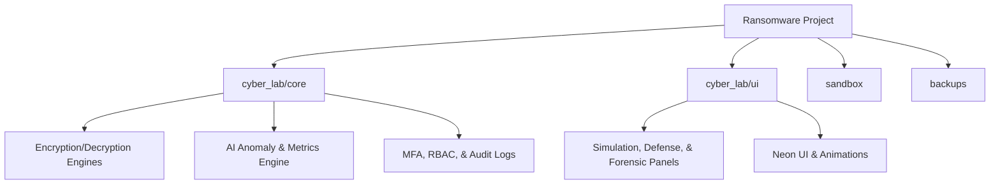
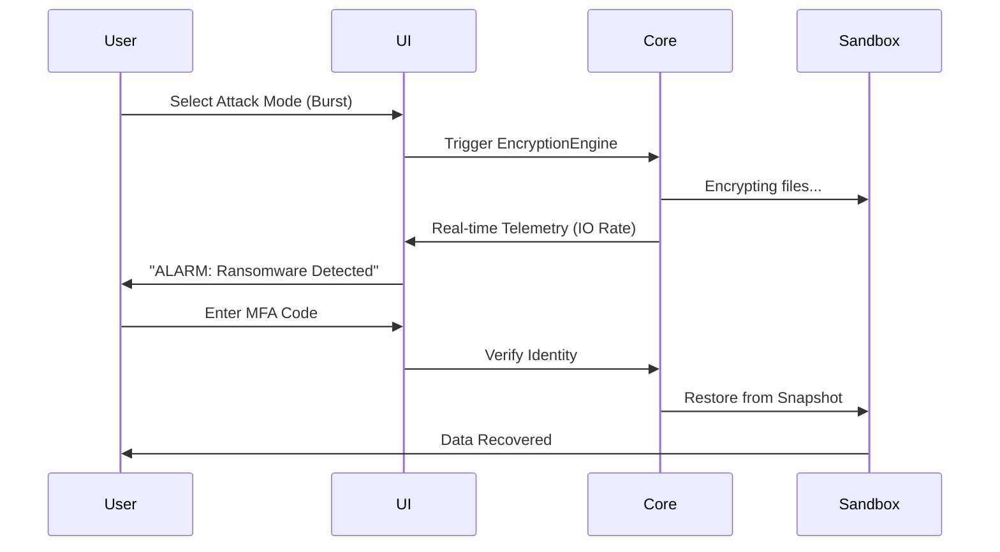

# 🛡 CyberLab: Ransomware Simulation & Defense Mechanism

> **One-line Description**: A high-fidelity, educational cybersecurity sandbox for simulating ransomware attacks and deploying multi-layered defense mechanisms in a safe, controlled environment.

## 📷 Screenshots


## ⚠️ CAUTION & DISCLAIMERS

### **Cautions**

>[!caution]
> - This software simulates a ransomware attack within a dedicated `sandbox` folder.
> - **DO NOT** use the simulation keys or engines on your personal or sensitive data.
> - Always ensure the simulation path is correctly pointing to the project's internal `sandbox` directory.

### **Disclaimers**

> [!IMPORTANT]
> This project is built for **EDUCATIONAL AND RESEARCH PURPOSES ONLY**.
> The authors and contributors are not responsible for any misuse of the techniques or code provided. Using these methods against systems without explicit permission is illegal and unethical.

### **Notes**

>[!note]
> - All simulated "attacks" are performed on mock files within a local directory.
> - No actual malware or malicious payloads are included in this repository.

## 🛡️ INTRODUCTION

In an era where ransomware causes billions in global damages, understanding the "Kill Chain" and defense strategies is critical. **CyberLab** is a comprehensive toolkit designed to demonstrate how ransomware operates—from delivery to encryption—and how elite defense systems detect, block, and recover from such threats.

### **What is Ransomware?**

Ransomware is a type of malicious software (malware) designed to block access to a computer system or encrypt data until a sum of money (ransom) is paid.

- **Real-Life Example**: The _WannaCry_ attack of 2017 encrypted hundreds of thousands of computers globally, crippling hospitals and businesses.
- **The Mechanism**: It typically gains access via phishing or vulnerabilities, then uses asymmetric or symmetric encryption to lock files.

### **What is a Defense Mechanism?**

A defense mechanism is a proactive or reactive security measure taken to protect digital assets.

- **Example**: Behavior monitoring (watching for high-speed file changes) or automated backups (snapshots).
- **Safety Strategy**: Maintaining the "3-2-1" backup rule (3 copies, 2 different media, 1 offsite).

## 🚀 INSTALLATION & RUNNING

### **Requirements**

- Python 3.10+
- Virtual Environment (recommended)

### **How to Install**

1. **Clone the repository**:
   ```bash
   git clone https://github.com/SyedShaheerHussain/Ransomware-Simulation-and-Defense-Mechanism-Python-GUI
   cd "Ransomware Simulation and Defense Mechanism"
   ```
   ```

2. **Setup Environment**:
   ```powershell
   python -m venv .venv

   ```
   ```
   .venv\Scripts\Activate.ps1
   
   ```
3. **Install Dependencies**:
   ```bash
   pip install -r requirements.txt
   
   ```

### **How to Run**

Launch the GUI Application:

```bash
python cyber_lab/app.py

```

## 📊 FOLDER STRUCTURE



- **`cyber_lab/core/`**: The "Brain" - holds encryption logic, AI engines, and security protocols.
- **`cyber_lab/ui/`**: The "Face" - PySide6 GUI panels and cinematic animations.
- **`sandbox/`**: The "Target" - where all mock files are encrypted and restored.
- **`backups/`**: The "Vault" - immutable snapshots of original data.

## 🛠️ TECHNOLOGIES & TECHNIQUES

| Category       | Technology               | Purpose                                           |
| :------------- | :----------------------- | :------------------------------------------------ |
| **Language**   | Python 3                 | Core application logic.                           |
| **GUI**        | PySide6 (Qt)             | Premium Neon/Glassmorphism interface.             |
| **Encryption** | Fernet (Cryptography)    | High-speed symmetric encryption simulation.       |
| **AI**         | Scikit-learn (Simulated) | Anomaly detection and baseline profiling.         |
| **Security**   | TOTP (PyOTP)             | Multi-Factor Authentication (MFA).                |
| **Analytics**  | Matplotlib               | Real-time telemetry and encryption rate tracking. |

### **Simulated Attack Types (Simulation Modes)**

1. **Burst Attack**: High-speed, sequential encryption (Noisy).
2. **Stealth Attack**: Low and slow encryption with sleep intervals (Evasive).
3. **Random Spray**: Encrypts files in a non-linear order to bypass simple monitors.

## ✨ FEATURES & FUNCTIONS

### **1. Navigation Console (UI/UX)**

- **Neon Aesthetic**: A cinematic, high-contrast dashboard with particle backgrounds and CRT scanline overlays.
- **Visual Feedback**: Real-time alerts and progress bars for every operation.

### **2. Simulation Engine**

- **`Launch Ransomware Attack`**: Triggers the cryptographic engine to lock simulator files.
- **`Process Simulator`**: Automates complex attack patterns (Stealth vs. Burst).

### **3. Defense Operations Center**

- **Behavior Monitoring**: Real-time file system watchers (`watchdog`) detect unauthorized changes.
- **Honeypot Traps**: Fake sensitive files that trigger an immediate alarm if touched.
- **AI Anomaly Engine**: Established baseline system metrics; alerts on 2.5x standard deviations in CPU/IO.

### **4. Key Vault & Identity**

- **Key Manager**: Generates and archives encryption keys (Fernet).
- **MFA (TOTP)**: Requires a 6-digit code (simulated via `pyotp`) to perform sensitive "Restore" actions.
- **RBAC**: Role-Based Access Control (Admin vs. Operator).

### **5. Forensic Lab**

- **Memory Dumps**: Captures simulated "strings" and "anomalies" found during an attack.
- **Pen-Test Scanner**: Vulnerability scanning module to find paths like "Insecure Backups" or "Weak Auth".

## 📈 SYSTEM FLOW



## 🎓 WHAT I LEARNED & MARKET VALUE

### **What I Built For**

- **Target Audience**: Cybersecurity students, SOC analysts, and security enthusiasts.
- **Goal**: To demystify ransomware encryption and showcase modern defense-in-depth strategies.

### **Learning Outcomes**

- Mastered **Symmetric Encryption** and Key Lifecycle Management.
- Implemented **Behavioral Analysis** using file-system hooks.
- Designed a **High-Performance GUI** with multithreading (QThread) to prevent UI freezes.
- Integrated **Corporate Security Features** like Audit Logging and RBAC.

### **Market Value**

This project represents a professional-grade simulation tool. In the trending cybersecurity market, "Breach and Attack Simulation" (BAS) is a billion-dollar sector. Skills in building self-healing systems and forensic visibility are highly sought after by top-tier security firms.

## 🔮 FUTURE ENHANCEMENTS

- **Network Propagation**: Simulate ransomware spreading to a mock LAN.
- **Web Interface**: Transition the GUI to a React/Vite dashboard with a FastAPI backend.
- **Hardware MFA**: Support for physical security keys (Yubikey simulation).

## 🏷️ TAGS & HASHES

#CyberSecurity #Ransomware #Python #BlueTeam #RedTeam #Pentesting #Forensics #AI #NeonUI #EduTech #Encryption

_Created with ❤️ for the future defenders of the digital realm._ _**(Syed Shaheer Hussain 2026 ©)**_
